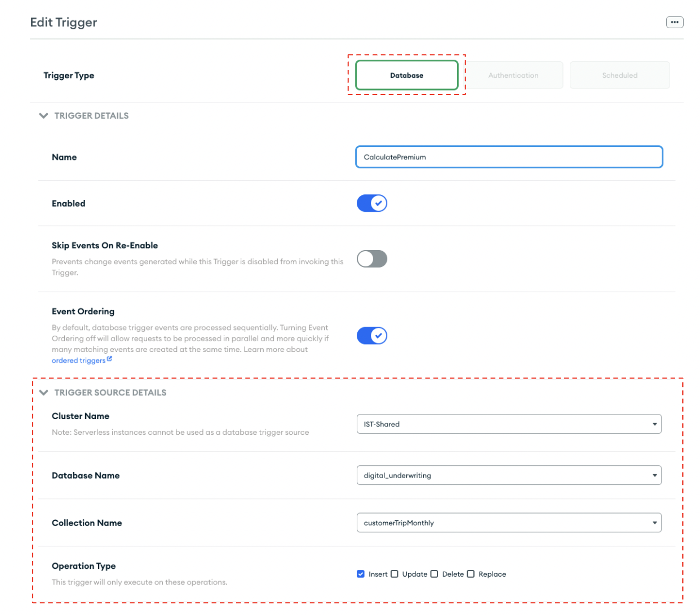
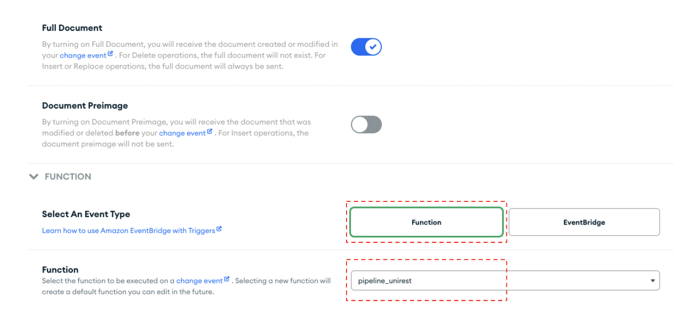

# Step 4: Setting up a "Calculate Premium" Trigger 
Everytime a new monthly summary is created an Atlas function called [“pipeline_unirest”](MaterializedViews/monthlyTrigger.js)will post the total distance and the baseline premium to Databricks for ML productions. 

Let’s configure the trigger that does this! 
* Navigate to App Services and click on “Triggers” 
* Add a Trigger 
* Select a Database trigger as seen in the figure below 
* Configure the “Trigger Source Details” to your needs 

 
* Click the “Function” button as seen in the figure below and select the [pipeline_unirest function](MaterializedViews/monthlyTrigger.js). 

 
