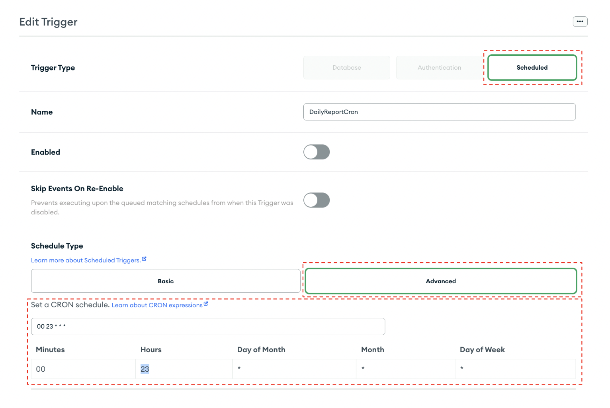
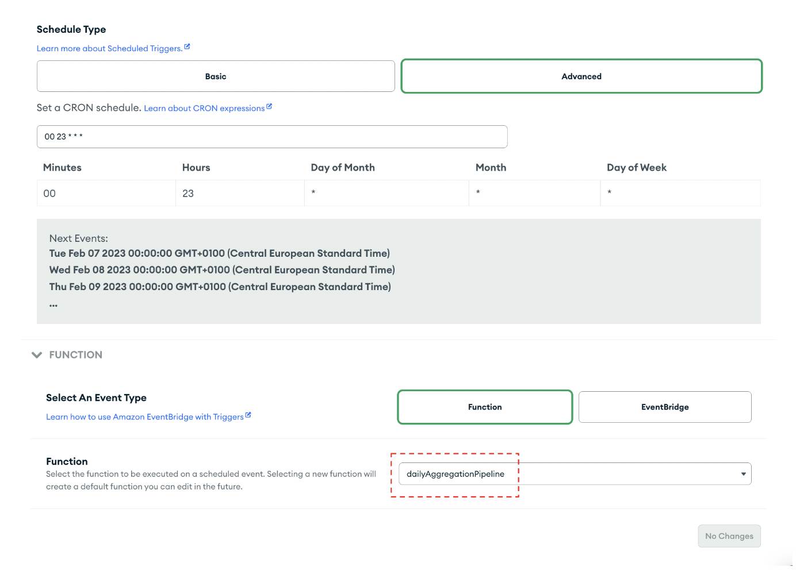
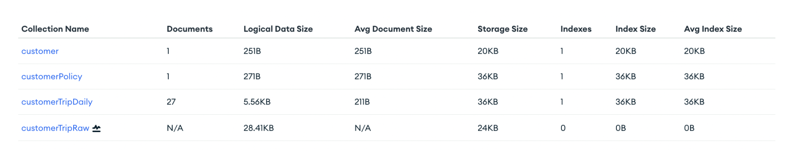
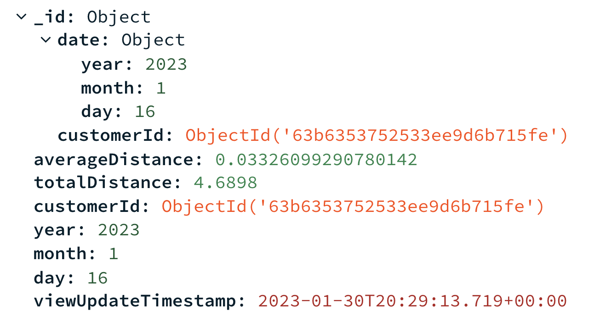

# Step 2: Setting up a Daily Cron Job

After you’ve loaded your sample data in MongoDB Atlas, you’ll set up a daily cron job. Whenever all of the fields in a CRON expression match the current date and time, Atlas fires the trigger associated with the expression.  
* Navigate to App Services and click on “Triggers” 
* Add a Trigger 
* Select a [Scheduled Trigger type](https://www.mongodb.com/docs/atlas/app-services/triggers/scheduled-triggers/) as seen in THE figure below

* Name it
* Click the “Advanced” button and under “Set a CRON schedule” input the desired daily time. In our case it is midnight. This ensures that every day at midnight the dailyAggregationPipeline function is triggered, which aggregates all of the daily trips into a new document that summarizes the distances driven during that day. 
* Click the “Function” button as seen in the figure below and select the [dailyAggregationPipeline function](MaterializedViews/dailyTrigger.js).

At midnight everyday, a new collection called “customerTripDaily” will be added in your Atlas Data Services collection. All of the daily documents will now be stored here as seen in the figure below. 

 

In the figure below you can see an example of what a daily document will look like: 

 
