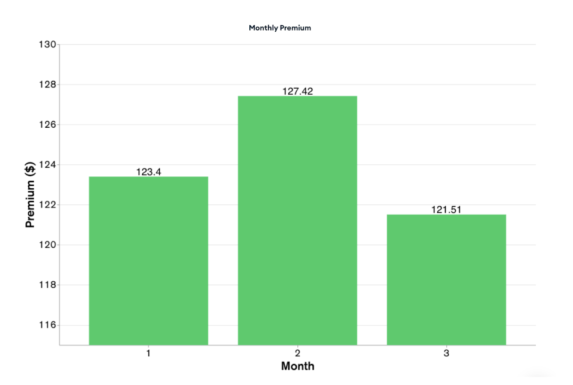

You can also visualize your data with MongoDB Charts allowing you to gain visual insights and making it easy to discern patterns and trends within your dataset. If you’re interested in experimenting with Charts, please refer to the Getting Started Tutorial. 

An example Chart: 

