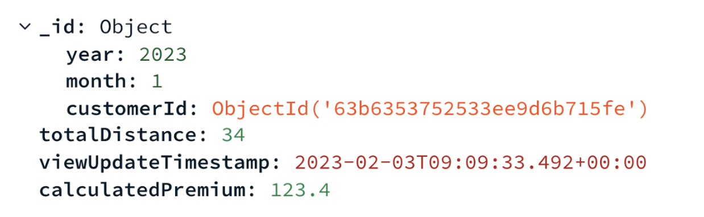

# Step 6: ML Prediction is written to MongoDB 
Once your Databricks ML model has completed running, the “pipeline_unirest” function we’ve set up earlier, ensures that the new calculated premium is written back to MongoDB. 
* Navigate to Data Services and to your collection 
* Navigate to “customerTripMonthly”. There you’ll find the new calculated premium as seen in the figure below.

 
