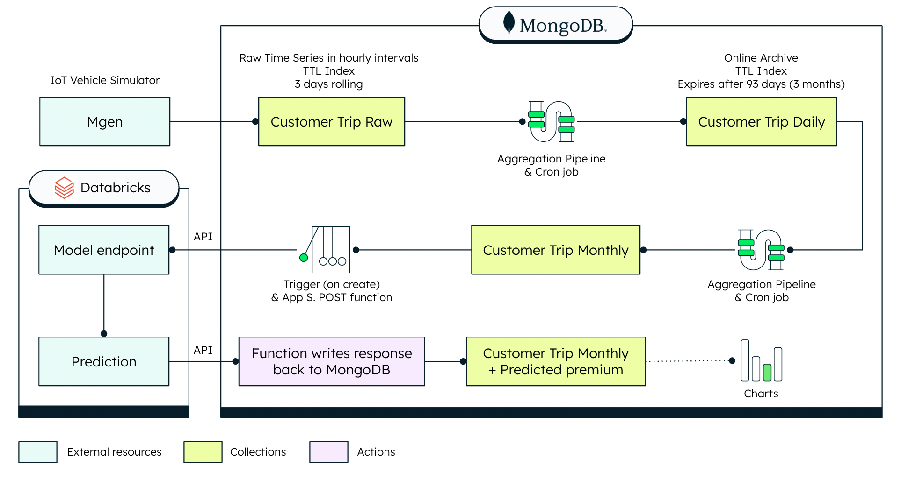

# Digital Underwriting: Usage-Based-Insurance

Underwriting is a critical aspect of insurance companies, and its efficiency plays a major role in the company’s profitability and success. MongoDB helps to streamline the underwriting process by providing a flexible and scalable database solution for storing and processing vast amounts of real-time data. 

In this GitHub repository, we will demonstrate how to utilize MongoDB to build an automated underwriting process to calculate a customized premium for a connected car. By using the sample customer “Eddie Grant”, we will show how easy it is to calculate a data-driven insurance premium with MongoDB and Databricks, as outlined in the architecture below. 

**Quick Take**

*A dataset including the total distance driven in car journeys is loaded into MongoDB and a daily cron job is run every day at midnight, which summarizes the daily trips into a document stored in a new collection called “CustomerTripDaily”. A monthly cron job is run on the 25th day of each month, aggregating the daily documents and creating a new collection called “Customer Trip Monthly”. Every time a new monthly summary is created, an Atlas function posts the total distance for the month and baseline premium to Databricks for ML prediction. The ML prediction is then sent back to MongoDB and added to the “Customer Trip Monthly” document. As a final step, you can visualize all of your data with MongoDB Charts.*

Now let's dive deeper and get started!

# Demonstration
[Step by Step Demonstration: An Automated Digital Underwriting Use Case](src/StepbyStep.md)
