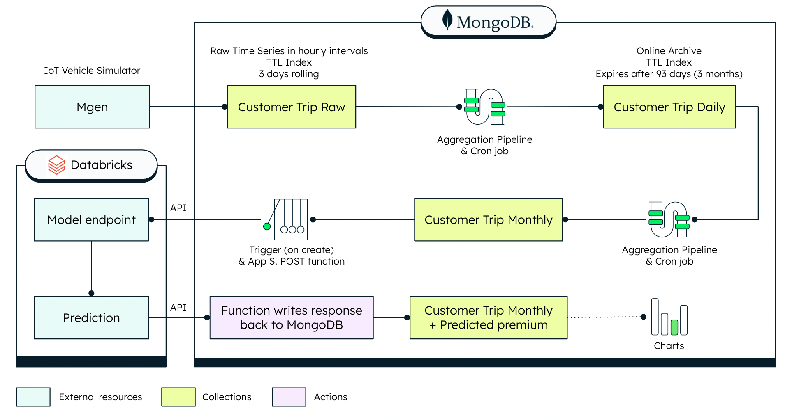

# Step 1: Load the Sample Data
[Load the Sample Data](LoadingtheSampleData.md)

# Step 2: Set up a Daily Cron Job
[Set up a Daily Cron Job](DailyCronJob.md)

# Step 3: Set up a Monthly Cron Job
[Set up a Monthly Cron Job](MonthlyCronJob.md)

# Step 4: Set up a "Calculate Premium" Trigger 
[Set up a "Calculate Premium" Trigger](CalculatePremiumTrigger.md)

# Step 5: Set up the Databricks configuration 
[Set up the Databricks configuration](DatabricksConfiguration.md)

# Step 6: Write the ML Prediction to MongoDB 
[Write the ML Prediction to MongoDB](Prediction.md)

And that’s a wrap! Within 6 simple steps you are able to create an automatic data-driven insurance premium for connected cars. 

# Bonus: Data Visualization 
[Data Visualization](DataVisualization.md)

