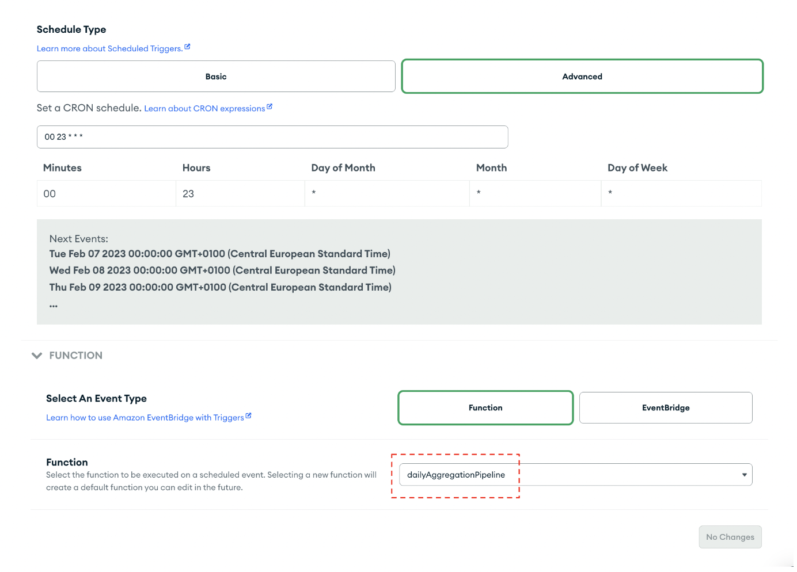
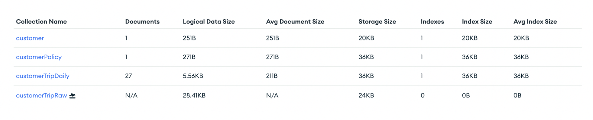
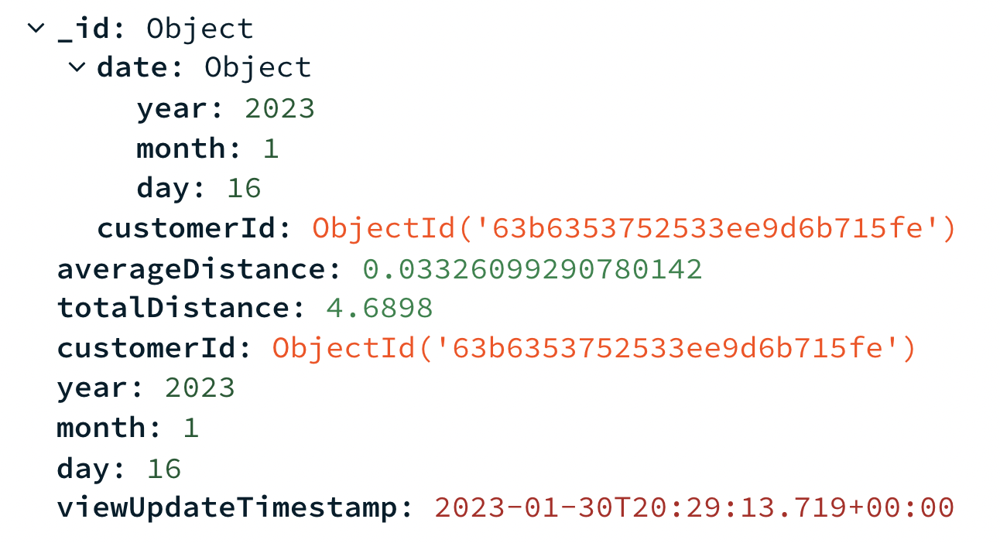

# Step 1: Loading the Sample Data

[Load the following sample data](https://www.mongodb.com/docs/guides/atlas/sample-data/) from our sample customer [“Eddie Grant”](Collections/Customer) into your MongoDB Atlas account.  

In your MongoDB Atlas cloud dashboard you should now see 3 collections as seen in the figure below: 
* [customer](Collections/Customer)
* [customerPolicy](Collections/Policy)
* [customerTripRaw](Collections/CustomerTripRaw)

In a real-world scenario, insurers would most likely collect time-series data. However, for ease of demonstration purposes, our sample data consists of all the trips taken during a 3-month time period. 

# Step 2: Setting up a Daily Cron Job

After you’ve loaded your sample data in MongoDB Atlas, you’ll set up a daily cron job. Whenever all of the fields in a CRON expression match the current date and time, Atlas fires the trigger associated with the expression.  
* Navigate to App Services and click on “Triggers” 
* Add a Trigger 
* Select a [Scheduled Trigger type](https://www.mongodb.com/docs/atlas/app-services/triggers/scheduled-triggers/) as seen in THE figure below

* Name it
* Click the “Advanced” button and under “Set a CRON schedule” input the desired daily time. In our case it is midnight. This ensures that every day at midnight the dailyAggregationPipeline function is triggered, which aggregates all of the daily trips into a new document that summarizes the distances driven during that day. 
* Click the “Function” button as seen in the figure below and select the [dailyAggregationPipeline function](MaterializedViews/dailyTrigger.js).

At midnight everyday, a new collection called “customerTripDaily” will be added in your Atlas Data Services collection. All of the daily documents will now be stored here as seen in the figure below. 

 

In the figure below you can see an example of what a daily document will look like: 

 

# Step 3: Setting up a Monthly Cron Job

Now we’ll do a similar process, but for a monthly cron job! In our case, a monthly CRON job is run on the 25th day of each month triggering the “monthlyAggregationPipeline” function which aggregates the daily documents and creates a new collection called “Customer Trip Monthly”. 
* Navigate to App Services and click on “Triggers” 
* Add a Trigger 
* Select a [Scheduled Trigger](https://www.mongodb.com/docs/atlas/app-services/triggers/scheduled-triggers/) type as seen in the figure below

* Name it “MonthlyReportCron” 
Click the “Basic” button and under “Repeat once by:” input the desired day of the month as seen in Figure . In our case, we put the 25th day of each month. 
Click the “Function” button as seen in the figure below and select the [monthlyAggregationPipeline function](MaterializedViews/MonthlySummary). 

 

After the 25th of the month, you can navigate back to your Atlas Data Services digital underwriting collection, where you’ll see a new collection called “customerTripMonthly”. All of the monthly documents will now be stored here as seen in the figure below. 

 

# Step 4: Setting up a "Calculate Premium" Trigger 
Everytime a new monthly summary is created an Atlas function called [“pipeline_unirest”](MaterializedViews/monthlyTrigger.js)will post the total distance and the baseline premium to Databricks for ML productions. 

Let’s configure the trigger that does this! 
* Navigate to App Services and click on “Triggers” 
* Add a Trigger 
* Select a Database trigger as seen in the figure below 
* Configure the “Trigger Source Details” to your needs 

 
* Click the “Function” button as seen in the figure below and select the [pipeline_unirest function](MaterializedViews/monthlyTrigger.js). 

 

# Step 5: Setting up the Databricks configuration 

