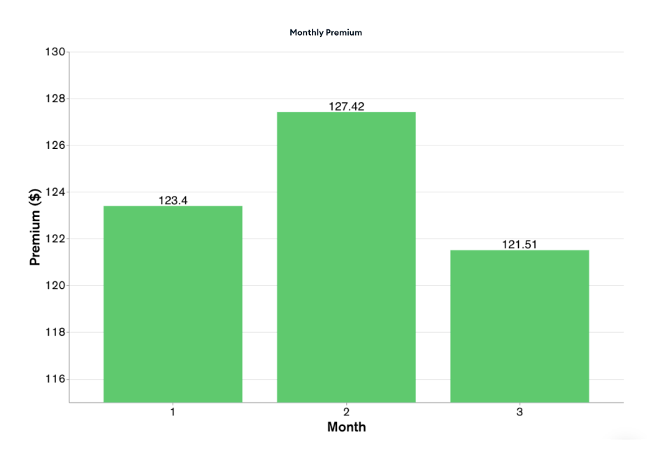

# Step 1: Loading the Sample Data
[Loading the Sample Data](LoadingtheSampleData.md)

# Step 2: Setting up a Daily Cron Job
[Setting up a Daily Cron Job](DailyCronJob.md)

# Step 3: Setting up a Monthly Cron Job
[Setting up a Monthly Cron Job](MonthlyCronJob.md)

# Step 4: Setting up a "Calculate Premium" Trigger 
[Setting up a "Calculate Premium" Trigger](CalculatePremiumTrigger.md)

# Step 5: Setting up the Databricks configuration 

# Step 6: ML Prediction is written to MongoDB 
Once your Databricks ML model has completed running, the “pipeline_unirest” function we’ve set up earlier, ensures that the new calculated premium is written back to MongoDB. 
* Navigate to Data Services and to your collection 
* Navigate to “customerTripMonthly”. There you’ll find the new calculated premium as seen in the figure below.

 

And that’s a wrap! Within 6 simple steps you are able to create an automatic data-driven insurance premium for connected cars. 

# Bonus: Data Visualization 
You can also visualize your data with MongoDB Charts allowing you to gain visual insights and making it easy to discern patterns and trends within your dataset. If you’re interested in experimenting with Charts, please refer to the Getting Started Tutorial. 

An example Chart: 

