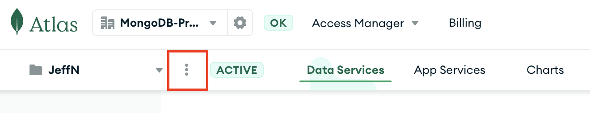
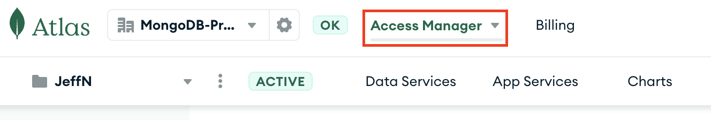
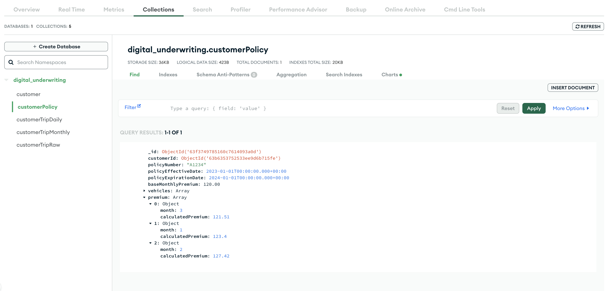

# Automated deployment for MongoDB Atlas

This is to create the MongoDB Atlas cluster, load data inside and create the app in app services.
The prerequiste here is to have created the ML model endpoint as this will be needed to create one of the app services function.
Please note that these scripts only work with a paid Atlas cluster.

## Step 1 - Installations

Ensure you have npm, realm-cli and the mongodb tools.
The following lines about MongoDB tools are for Mac only. For other OS check the [documentation](https://www.mongodb.com/docs/database-tools/installation/installation/) 

```
npm install -g mongodb-realm-cli
brew tap mongodb/brew
brew install mongodb-database-tools
brew install jq
```

## Step 2 - Update Credentials file

Go to the Atlas UI, if you already have a project created, go to the project setting page. If not, create one and then click on the 3 dots and then on project settings.



On the project setting page, copy your project ID and put it in **GROUPID** of the *credentials.sh* file.
Go to the access manager



and click on Create API Keys. Create a API with project owner permission and update the **PUBKEY** and **PRIVKEY** of the *credentials.sh* file with the API keys.

## Step 3 - Update the app services function

Clone the auto-deployment Github folder to your local machine. Using your ML platform of choice, copy the API endpoint of the deployed model. Once your model endpoint is created, open the [pipeline_unirest](insuranceDemoApp/functions/pipeline_unirest.js) function and update it with your **MODEL ENDPOINT** and its **CREDENTIALS**

[Here](https://github.com/mongodb-industry-solutions/Digital-Underwriting-Usage-Based-Insurance/edit/main/src/DatabricksConfiguration.md) you can find our Databricks implementation.


## Step 4 - Execute the autodeployment script

Run the following command

```
chmod +x create-cluster.sh
```
then 

```
./create-cluster.sh
```
If the script is working the terminal should prompt: "Waiting 15min before attempting restore". After 15 minutes the cluster is spun up and the data is loaded into Atlas. 
Then select all the default answers for the app creation and say **Yes** to allow the app creation


If the App creation succeded the terminal should prompt "App is created".

## Step 5 - Run the functions

You can now open your newly created app in the "App Services" section in Atlas. On the left menu you can find the Functions section, click on it and you should see 3 functions: dailyAggregationPipeline, monthlyAggregationPipeline and pipeline_unirest. Click on dailyAggregationPipeline  and push the "Run" botton at the bottom. Repeat for monthlyAggregationPipeline. The order is important here.

If everything worked, once you go to the "Data Services" section in Atlas and you browse the collections in your database, this is what you should see:



You're done! As you can see, Databricks calculated the new adjusted premium for the three months of data that we provided.

