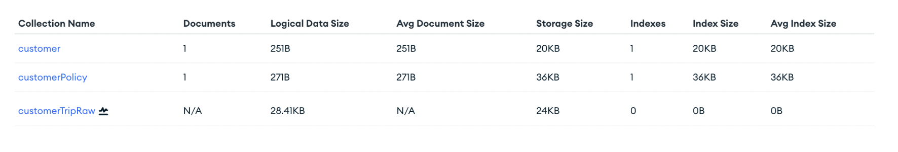

# Step 1: Load the Sample Data

Load the three collections contained in the [Collections](Collections) folder: Customer, Policy and customerTripRaw.json
into your [MongoDB Atlas account](https://account.mongodb.com/account/login). Please note that customerTripRaw.json should be added as a time series collection, we specify that by running the command included in [CustomerTripRawTS](Collections/CustomerTripRawTS).

In your MongoDB Atlas cloud dashboard you should now see 3 collections as seen in the figure below: 
* [customer](Collections/Customer)
* [customerPolicy](Collections/Policy)
* [customerTripRaw](Collections/customerTripRaw.json)

In a real-world scenario, insurers would most likely collect live data from a connected vehicle. However, for ease of demonstration, our sample data consists of all the trips taken during a 3-month time period. 

Now let's jump to [Step 2](DailyCronJob.md), where we'll set up a daily cron job. 
