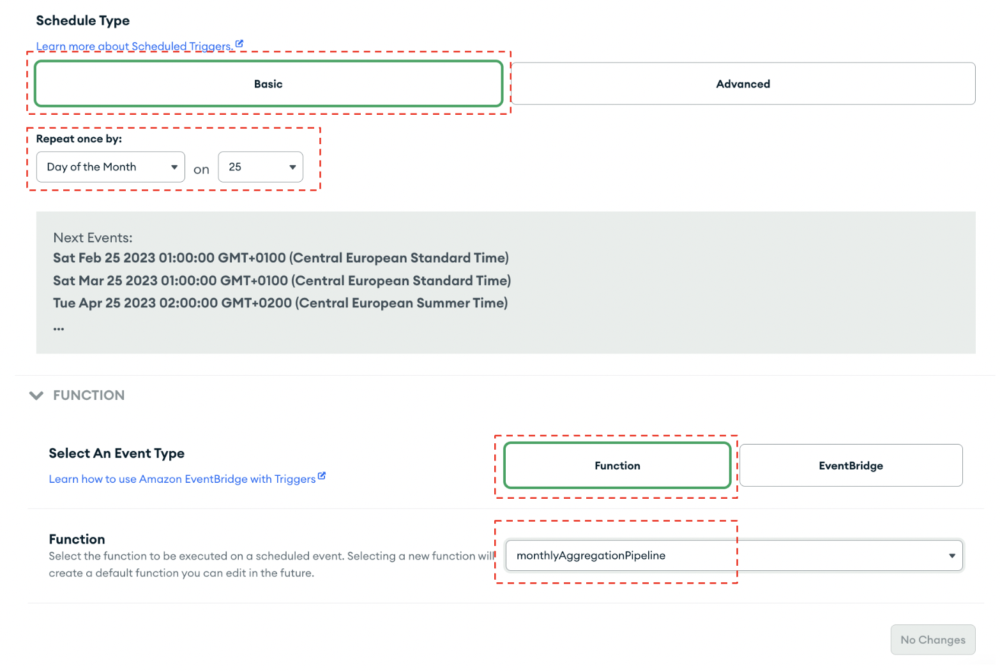

# Step 3: Setting up a Monthly Cron Job

Let's set up a monthly cron job! In our case, a monthly CRON job is run on the 25th day of each month triggering the [“monthlyAggregationPipeline”](https://github.com/mongodb-industry-solutions/Digital-Underwriting-Usage-Based-Insurance/blob/main/src/MaterializedViews/MonthlySummary) function which aggregates the daily documents and creates a new collection called “Customer Trip Monthly”. 
* Navigate to App Services and click on “Triggers”. 
* Add a Trigger. 
* Select a [Scheduled Trigger](https://www.mongodb.com/docs/atlas/app-services/triggers/scheduled-triggers/) type as seen in the figure below.

* Name it “MonthlyReportCron” 
Click the “Basic” button and under “Repeat once by:” input the desired day of the month as seen in the figure below. In our case, we put the 25th day of each month. 
Click the “Function” button as seen in the figure below and select the [monthlyAggregationPipeline function](MaterializedViews/MonthlySummary). 

 

After the 25th of the month, you can navigate back to your Atlas Data Services digital underwriting collection, where you’ll see a new collection called “customerTripMonthly”. All of the monthly documents will now be stored here as seen in the figure below. 

 

Let's move on to [Step 4](CalculatePremiumTrigger.md) where we will set up a trigger that will calculate the new monthly premium. 
