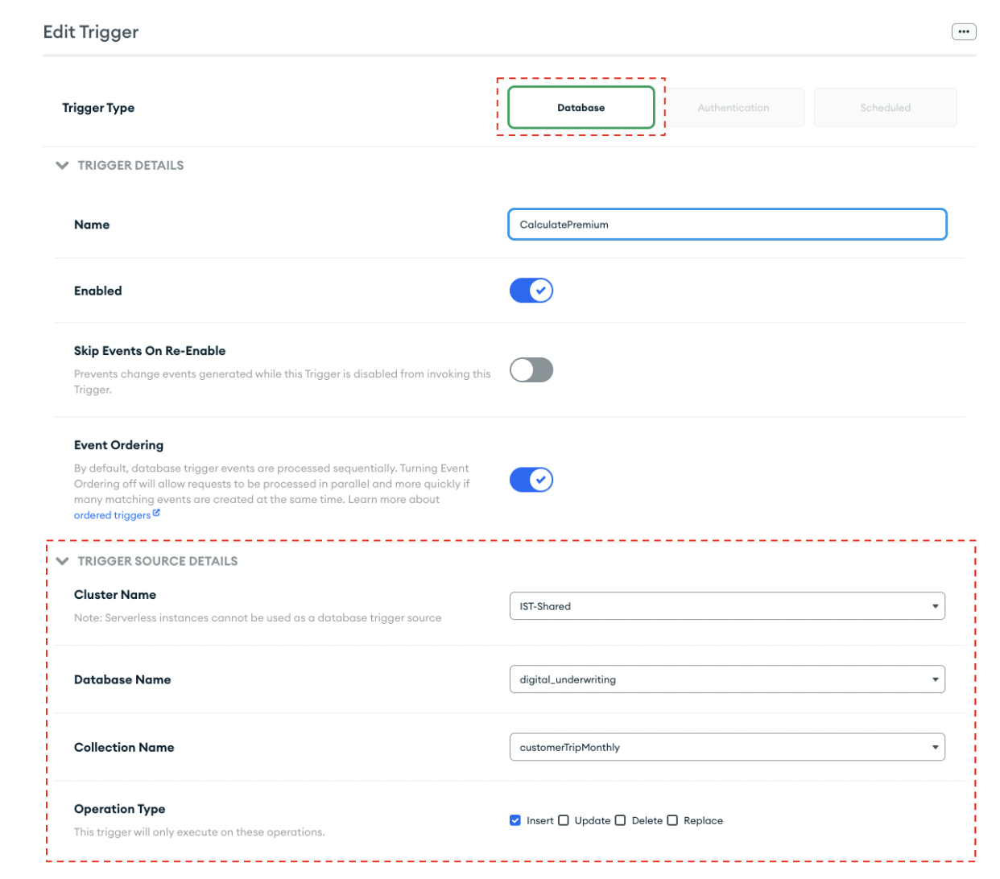
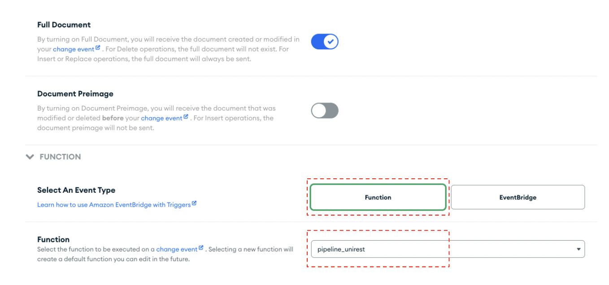

# Step 4: Setting up a "Calculate Premium" Trigger 
Every time a new monthly summary is created an Atlas function called [“pipeline_unirest”](MaterializedViews/monthlyTrigger.js) will post the total distance and the baseline premium to Databricks for ML productions. 

Let’s configure the trigger that does this! 
* Navigate to App Services and click on “Triggers”. 
* Add a Trigger. 
* Select a Database trigger as seen in the figure below. 
* Configure the “Trigger Source Details” to your needs. 

 
* Click the “Function” button as seen in the figure below and select the [pipeline_unirest function](pipeline_unirest.js). 

 

This will post the total distance for the month and the baseline premium to Databricks for ML prediction. Now let's set up the Databricks configuration in [Step 5](DatabricksConfiguration.md).
